# Diagrama Entidad-Relación (DER) - TenisAhora

Este documento contiene la especificación formal del Modelo Entidad-Relación para el sistema de gestión deportiva **TenisAhora** (Ingeniería de Software - UNAJ).

---

## 1. Diagrama ERD (Mermaid)

```mermaid
erDiagram
    USUARIO {
        int id_usuario PK
        string nombre
        string apellido
        int dni
        datetime fecha_nacimiento
        string direccion
        string telefono
        string correo_electronico
        string contrasenia
    }

    SOCIO {
        int id_usuario PK,FK
        string estado_membresia
    }

    ADMINISTRADOR {
        int id_usuario PK,FK
        string legajo
    }

    PROFESOR_ENTRENADOR {
        int id_profesor PK,FK
        string titulo_habilitante
        string certificacion
        string especialidad
        int antiguedad
    }

    EQUIPO {
        int id_equipo PK
        string nombre
    }

    EQUIPO_USUARIO {
        int id_equipo PK,FK
        int id_usuario PK,FK
    }

    TIPO_CANCHA {
        int id_tipo_cancha PK
        string superficie
        int capacidad
        decimal precio_base
    }

    CANCHA {
        int id_cancha PK
        int id_tipo_cancha FK
        string numero_o_nombre
    }

    DISPONIBILIDAD {
        int id_disponibilidad PK
        int id_cancha FK
        datetime fecha_inicio
        datetime fecha_fin
        string estado
    }

    DESCUENTO {
        int id_descuento PK
        decimal porcentaje
        string descripcion
        string condiciones
    }

    STOCK {
        int id_stock PK
        string tipo_elemento
        int cantidad_disponible
    }

    RESERVA {
        int id_reserva PK
        int id_usuario FK
        int id_cancha FK
        int id_descuento FK
        datetime fecha_reserva
        datetime fecha_hora_inicio
        datetime fecha_hora_fin
        string estado
        int cantidad_personas
        decimal importe_total
    }

    DETALLE_STOCK_RESERVA {
        int id_detalle PK
        int id_reserva FK
        int id_stock FK
        int cantidad
    }

    ACTIVIDAD {
        int id_actividad PK
        int id_profesor FK
        int id_cancha FK
        string tipo_actividad
        datetime fecha
        time hora_inicio
        time hora_fin
        int duracion
        int cupo_maximo
    }

    REGLAMENTO {
        int id_reglamento PK
        string nombre
        string contenido
        bool vigencia
        string tipo_reglamento
    }

    COMPETENCIA {
        int id_competencia PK
        int id_reglamento FK
        string nombre
        datetime fecha_inicio
        datetime fecha_fin
        string categoria_genero
        string modalidad
        string estado
    }

    TORNEO {
        int id_competencia PK,FK
        string etapa_actual
        string tipo_llave
    }

    LIGA {
        int id_competencia PK,FK
        int cantidad_fechas
        int puntos_por_partido
    }

    PARTIDO {
        int id_partido PK
        int id_competencia FK
        int id_cancha FK
        int id_equipo_1 FK
        int id_equipo_2 FK
        int id_equipo_ganador FK
        datetime fecha_hora
        string ronda
        string resultado
        string estado
    }

    INSCRIPCION {
        int id_inscripcion PK
        int id_usuario FK
        datetime fecha
        string estado
    }

    INSCRIPCION_ACTIVIDAD {
        int id_inscripcion PK,FK
        int id_actividad FK
    }

    INSCRIPCION_COMPETENCIA {
        int id_inscripcion PK,FK
        int id_competencia FK
        int id_equipo FK
    }

    PAGO {
        int id_pago PK
        int id_reserva FK
        int id_inscripcion FK
        decimal importe
        datetime fecha_pago
        string tipo_pago
        string medio_pago
        string estado
        string qr
    }

    RECIBO {
        int id_recibo PK
        int id_pago FK
        datetime fecha_emision
        decimal importe
    }

    %% Relaciones de Usuarios y Roles
    USUARIO ||--o| SOCIO : "es"
    USUARIO ||--o| ADMINISTRADOR : "es"
    USUARIO ||--o| PROFESOR_ENTRENADOR : "es"
    USUARIO ||--o{ RESERVA : "realiza"
    USUARIO ||--o{ INSCRIPCION : "genera"
    USUARIO ||--o{ EQUIPO_USUARIO : "integra"

    %% Equipos y Modalidad (Single / Dobles)
    EQUIPO ||--o{ EQUIPO_USUARIO : "tiene socios"
    EQUIPO ||--o{ PARTIDO : "disputa como local (equipo 1)"
    EQUIPO ||--o{ PARTIDO : "disputa como visitante (equipo 2)"
    EQUIPO ||--o{ INSCRIPCION_COMPETENCIA : "se inscribe (dobles)"

    %% Canchas e Infraestructura
    TIPO_CANCHA ||--o{ CANCHA : "clasifica"
    CANCHA ||--o{ RESERVA : "aloja"
    CANCHA ||--o{ DISPONIBILIDAD : "gestiona"
    CANCHA ||--o{ ACTIVIDAD : "asigna espacio"
    CANCHA ||--o{ PARTIDO : "se disputa en"

    %% Reservas, Descuentos y Stock
    DESCUENTO ||--o{ RESERVA : "aplica a"
    RESERVA ||--o{ DETALLE_STOCK_RESERVA : "incluye"
    STOCK ||--o{ DETALLE_STOCK_RESERVA : "alquila insumo"

    %% Clases / Actividades
    PROFESOR_ENTRENADOR ||--o{ ACTIVIDAD : "dicta"
    ACTIVIDAD ||--o{ INSCRIPCION_ACTIVIDAD : "recibe inscriptos"

    %% Competencias y Reglamentos
    REGLAMENTO ||--o{ COMPETENCIA : "rige"
    COMPETENCIA ||--o| TORNEO : "es (subtipo)"
    COMPETENCIA ||--o| LIGA : "es (subtipo)"
    COMPETENCIA ||--o{ PARTIDO : "organiza"
    COMPETENCIA ||--o{ INSCRIPCION_COMPETENCIA : "recibe inscriptos"

    %% Jerarquía de Inscripciones
    INSCRIPCION ||--o| INSCRIPCION_ACTIVIDAD : "es"
    INSCRIPCION ||--o| INSCRIPCION_COMPETENCIA : "es"

    %% Pagos y Comprobantes
    RESERVA ||--o{ PAGO : "abona"
    INSCRIPCION ||--o{ PAGO : "abona"
    PAGO ||--|| RECIBO : "genera comprobante"
```

---

## 2. Diccionario de Entidades y Decisiones de Diseño

### 2.1 Usuarios, Roles y Equipos
* **`USUARIO` / `PERSONA`**: Entidad base con datos personales, autenticación y contacto.
* **Roles (`SOCIO`, `ADMINISTRADOR`, `PROFESOR_ENTRENADOR`)**: Especializaciones de la persona en el club.
* **`EQUIPO` y `EQUIPO_USUARIO` (N:M)**:
  * **Soporte Singles y Dobles**: Un `EQUIPO` representa la pareja o jugador participante del torneo.
    * En **Singles**: El equipo tiene 1 único usuario vinculado en `EQUIPO_USUARIO`.
    * En **Dobles**: El equipo tiene 2 usuarios vinculados en `EQUIPO_USUARIO`.
  * Esto permite que la entidad `PARTIDO` no duplique columnas ni diferencie estructuras si el partido es individual o por parejas.

### 2.2 Clases y Entrenamientos
* **`ACTIVIDAD`**:
  * Concentra tanto **Clases particulares** como **Entrenamientos grupales**.
  * Posee FK hacia `PROFESOR_ENTRENADOR` (quién dicta la clase) y hacia `CANCHA` (dónde se realiza).
  * Controla fecha, horarios, duración y cupo máximo de participantes.

### 2.3 Canchas y Disponibilidad
* **`TIPO_CANCHA`**: Define superficie (polvo de ladrillo, rápida/cemento, césped), capacidad y precio base por hora.
* **`CANCHA`**: Unidad física (Cancha 1, Cancha 2, etc.).
* **`DISPONIBILIDAD`**: Registra bloques de mantenimiento, apertura o bloqueos operativos de cada cancha.

### 2.4 Reservas y Stock
* **`RESERVA`**: Asocia a un socio/usuario con una cancha en una franja horaria. Contempla cantidad de personas, estado e importe calculado.
* **`DESCUENTO`**: Permite promociones (convenios, días especiales, socios al día).
* **`STOCK` y `DETALLE_STOCK_RESERVA`**: Permite alquilar o reservar elementos deportivos junto con la cancha (tubos de pelotas, raquetas, canastos).

### 2.5 Competencias, Reglamentos y Partidos
* **`REGLAMENTO`**: Documento oficial de normas y condiciones (1 reglamento puede regir para varias competencias).
* **`COMPETENCIA`**: Supertipo con atributos comunes (nombre, fechas, género, modalidad Single/Dobles, estado).
  * **`TORNEO`**: Subtipo por eliminación directa o llaves (etapa actual, tipo de llave).
  * **`LIGA`**: Subtipo de todos contra todos por fechas (fechas jugadas, puntos asignados).
* **`PARTIDO`**:
  * Relacionado a la `COMPETENCIA` y a la `CANCHA`.
  * Claves foráneas `id_equipo_1` e `id_equipo_2` para enfrentar a los contrincantes (tanto en single como en dobles).
  * Clave foránea `id_equipo_ganador` (nullable) y campo textual `resultado` (ej. `"6-4 3-6 7-6"`).

### 2.6 Inscripciones
* **`INSCRIPCION`**: Entidad base vinculada al `USUARIO` que realiza la solicitud.
* **`INSCRIPCION_ACTIVIDAD`**: Se vincula con la `ACTIVIDAD` correspondiente (clase/entrenamiento).
* **`INSCRIPCION_COMPETENCIA`**: Se vincula con la `COMPETENCIA` y con el `EQUIPO` (si es torneo de dobles).

### 2.7 Pagos y Recibos
* **`PAGO`**: Unifica la recaudación del club. Puede vincularse a una `RESERVA` (alquiler de cancha + stock) o a una `INSCRIPCION` (arancel de torneo o clase).
* **`RECIBO`**: Comprobante emitido con relación 1 a 1 con el pago.
