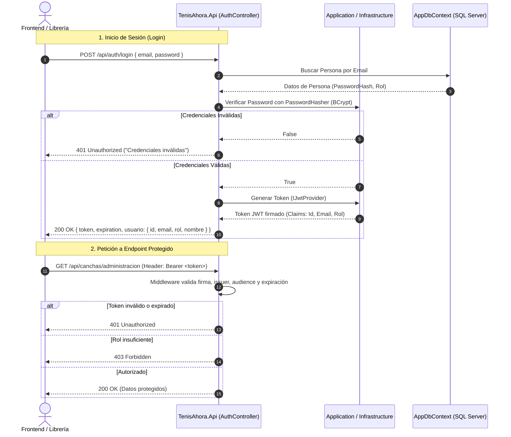

# Especificación de Autenticación y Autorización (JWT + Roles Personalizados) - TenisAhora

Este documento detalla la arquitectura, el diseño y la guía de implementación paso a paso para el mecanismo de autenticación y autorización basado en **JSON Web Tokens (JWT)** y **Roles personalizados** para el backend de **TenisAhora** (Ingeniería de Software - UNAJ).

---

## 1. Justificación y Alcance

Se opta por **JWT con roles personalizados** en lugar de *ASP.NET Core Identity* debido a:
1. **Simplicidad y ligereza:** Se evitan tablas autogeneradas innecesarias (`AspNetUsers`, `AspNetUserClaims`, etc.) y migraciones complejas.
2. **Control total del modelo:** Se utiliza directamente la jerarquía del dominio (`Persona`, `Socio`, `Administrador`, etc.).
3. **Facilidad de integración:** Provee un flujo estándar basado en cabeceras `Authorization: Bearer <token>`, permitiendo que la capa de servicios/librería consuma la identidad de forma desacoplada y directa.

---

## 2. Flujo de Autenticación y Autorización (Mermaid)



---

## 3. Implementación en 4 Pasos

### Paso 1: Dominio y Credenciales (`TenisAhora.Domain`)

#### 1.1 Definición de Roles
Crear el enumerador de roles en `TenisAhora.Domain/Enums/Rol.cs`:

```csharp
namespace TenisAhora.Domain.Enums;

public enum Rol
{
    Administrador = 1,
    Socio = 2,
    Profesor = 3,
    Entrenador = 4
}
```

#### 1.2 Entidad `Persona`
En `TenisAhora.Domain/Entities/Persona.cs`, exponer las propiedades como públicas, reemplazar el guardado de contraseña en texto plano por `PasswordHash` y agregar el rol:

```csharp
namespace TenisAhora.Domain.Entities;

public class Persona
{
    public int Id { get; set; }
    public string Nombre { get; set; } = string.Empty;
    public string Apellido { get; set; } = string.Empty;
    public int Dni { get; set; }
    public DateTime FechaDeNacimiento { get; set; }
    public string Telefono { get; set; } = string.Empty;
    public string Direccion { get; set; } = string.Empty;
    public int CodigoPostal { get; set; }
    public string Email { get; set; } = string.Empty;
    public string PasswordHash { get; set; } = string.Empty;
    public Rol Rol { get; set; }
}
```

---

### Paso 2: Hashing de Contraseñas y Generación de JWT (`Application` e `Infrastructure`)

#### 2.1 Paquetes NuGet Requeridos
En `TenisAhora.Infrastructure`:
- `System.IdentityModel.Tokens.Jwt`
- `Microsoft.IdentityModel.Tokens`
- `BCrypt.Net-Next`

#### 2.2 Contratos en `TenisAhora.Application`
Definir las interfaces para desacoplar la lógica de seguridad:

```csharp
// Application/Interfaces/IPasswordHasher.cs
namespace TenisAhora.Application.Interfaces;

public interface IPasswordHasher
{
    string Hash(string password);
    bool Verify(string password, string passwordHash);
}
```

```csharp
// Application/Interfaces/IJwtProvider.cs
using TenisAhora.Domain.Entities;

namespace TenisAhora.Application.Interfaces;

public interface IJwtProvider
{
    string GenerateToken(Persona persona);
}
```

#### 2.3 Implementación en `TenisAhora.Infrastructure`

```csharp
// Infrastructure/Security/PasswordHasher.cs
using TenisAhora.Application.Interfaces;

namespace TenisAhora.Infrastructure.Security;

public class PasswordHasher : IPasswordHasher
{
    public string Hash(string password) => BCrypt.Net.BCrypt.HashPassword(password);
    public bool Verify(string password, string passwordHash) => BCrypt.Net.BCrypt.Verify(password, passwordHash);
}
```

```csharp
// Infrastructure/Security/JwtProvider.cs
using System.IdentityModel.Tokens.Jwt;
using System.Security.Claims;
using System.Text;
using Microsoft.Extensions.Configuration;
using Microsoft.IdentityModel.Tokens;
using TenisAhora.Application.Interfaces;
using TenisAhora.Domain.Entities;

namespace TenisAhora.Infrastructure.Security;

public class JwtProvider : IJwtProvider
{
    private readonly IConfiguration _configuration;

    public JwtProvider(IConfiguration configuration)
    {
        _configuration = configuration;
    }

    public string GenerateToken(Persona persona)
    {
        var claims = new[]
        {
            new Claim(ClaimTypes.NameIdentifier, persona.Id.ToString()),
            new Claim(ClaimTypes.Email, persona.Email),
            new Claim(ClaimTypes.GivenName, $"{persona.Nombre} {persona.Apellido}"),
            new Claim(ClaimTypes.Role, persona.Rol.ToString())
        };

        var key = new SymmetricSecurityKey(
            Encoding.UTF8.GetBytes(_configuration["Jwt:SecretKey"]!)
        );
        var credentials = new SigningCredentials(key, SecurityAlgorithms.HmacSha256);

        var token = new JwtSecurityToken(
            issuer: _configuration["Jwt:Issuer"],
            audience: _configuration["Jwt:Audience"],
            claims: claims,
            expires: DateTime.UtcNow.AddMinutes(
                Convert.ToDouble(_configuration["Jwt:DurationInMinutes"] ?? "120")
            ),
            signingCredentials: credentials
        );

        return new JwtSecurityTokenHandler().WriteToken(token);
    }
}
```

---

### Paso 3: Configuración de la API y Pipeline (`TenisAhora.Api`)

#### 3.1 Paquete NuGet
En `TenisAhora.Api`:
- `Microsoft.AspNetCore.Authentication.JwtBearer`

#### 3.2 Configuración en `appsettings.json`
```json
{
  "Jwt": {
    "SecretKey": "ClaveSuperSecretaDeTenisAhoraConLongitudSuficiente12345!",
    "Issuer": "TenisAhoraApi",
    "Audience": "TenisAhoraClient",
    "DurationInMinutes": 120
  }
}
```

#### 3.3 Configuración en `Program.cs`
Registrar autenticación, autorización y soporte para tokens en Swagger:

```csharp
using System.Text;
using Microsoft.AspNetCore.Authentication.JwtBearer;
using Microsoft.IdentityModel.Tokens;
using Microsoft.OpenApi.Models;
using TenisAhora.Application.Interfaces;
using TenisAhora.Infrastructure.Security;

// Registro de servicios de seguridad
builder.Services.AddScoped<IPasswordHasher, PasswordHasher>();
builder.Services.AddScoped<IJwtProvider, JwtProvider>();

// Autenticación JWT
builder.Services.AddAuthentication(JwtBearerDefaults.AuthenticationScheme)
    .AddJwtBearer(options =>
    {
        options.TokenValidationParameters = new TokenValidationParameters
        {
            ValidateIssuer = true,
            ValidateAudience = true,
            ValidateLifetime = true,
            ValidateIssuerSigningKey = true,
            ValidIssuer = builder.Configuration["Jwt:Issuer"],
            ValidAudience = builder.Configuration["Jwt:Audience"],
            IssuerSigningKey = new SymmetricSecurityKey(
                Encoding.UTF8.GetBytes(builder.Configuration["Jwt:SecretKey"]!)
            )
        };
    });

builder.Services.AddAuthorization();

// Soporte de Bearer Token en Swagger UI
builder.Services.AddSwaggerGen(options =>
{
    options.AddSecurityDefinition("Bearer", new OpenApiSecurityScheme
    {
        Name = "Authorization",
        Type = SecuritySchemeType.Http,
        Scheme = "Bearer",
        BearerFormat = "JWT",
        In = ParameterLocation.Header,
        Description = "Ingrese su token JWT de la siguiente manera: Bearer {token}"
    });

    options.AddSecurityRequirement(new OpenApiSecurityRequirement
    {
        {
            new OpenApiSecurityScheme
            {
                Reference = new OpenApiReference
                {
                    Type = ReferenceType.SecurityScheme,
                    Id = "Bearer"
                }
            },
            Array.Empty<string>()
        }
    });
});

// Middleware Pipeline (respetar el orden)
app.UseAuthentication();
app.UseAuthorization();
```

---

### Paso 4: Casos de Uso, Controladores y Protección por Rol

#### 4.1 DTOs para Autenticación
```csharp
// LoginRequest.cs
public record LoginRequest(string Email, string Password);

// LoginResponse.cs
public record LoginResponse(string Token, int UsuarioId, string NombreCompleto, string Rol);
```

#### 4.2 Controlador de Autenticación (`AuthController`)
```csharp
[ApiController]
[Route("api/[controller]")]
public class AuthController : ControllerBase
{
    private readonly AppDbContext _context;
    private readonly IPasswordHasher _hasher;
    private readonly IJwtProvider _jwtProvider;

    public AuthController(AppDbContext context, IPasswordHasher hasher, IJwtProvider jwtProvider)
    {
        _context = context;
        _hasher = hasher;
        _jwtProvider = jwtProvider;
    }

    [HttpPost("login")]
    public async Task<IActionResult> Login([FromBody] LoginRequest request)
    {
        var persona = await _context.Personas.FirstOrDefaultAsync(p => p.Email == request.Email);
        if (persona is null)
            return Unauthorized("Credenciales inválidas.");

        if (!_hasher.Verify(request.Password, persona.PasswordHash))
            return Unauthorized("Credenciales inválidas.");

        var token = _jwtProvider.GenerateToken(persona);

        return Ok(new LoginResponse(
            token,
            persona.Id,
            $"{persona.Nombre} {persona.Apellido}",
            persona.Rol.ToString()
        ));
    }
}
```

#### 4.3 Protección de Endpoints
Utilizar atributos según el nivel de acceso requerido:

```csharp
// Accesible para cualquier usuario autenticado
[Authorize]
[HttpGet("perfil")]
public IActionResult ObtenerMiPerfil() { ... }

// Exclusivo para Administradores
[Authorize(Roles = "Administrador")]
[HttpPost("reportes")]
public IActionResult GenerarReporte() { ... }

// Accesible para Profesores y Entrenadores
[Authorize(Roles = "Profesor,Entrenador")]
[HttpPost("asistencias")]
public IActionResult RegistrarAsistencia() { ... }
```

---

## 4. Próximos Pasos para la Librería (Continuación en el Equipo)

Una vez completada esta configuración base:
1. **Consumo del Token:** La librería del cliente podrá almacenar el token (por ejemplo en `localStorage` o memoria) y adjuntarlo en cada petición HTTP mediante el encabezado `Authorization: Bearer <token>`.
2. **Decodificación en Frontend:** La librería puede leer el payload en Base64 para saber el rol y nombre del usuario de inmediato sin necesidad de consultar al backend en cada renderizado.